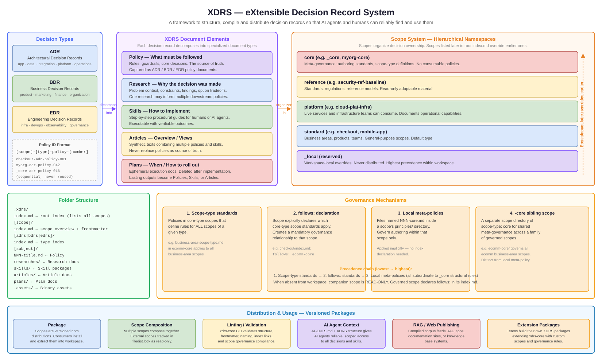
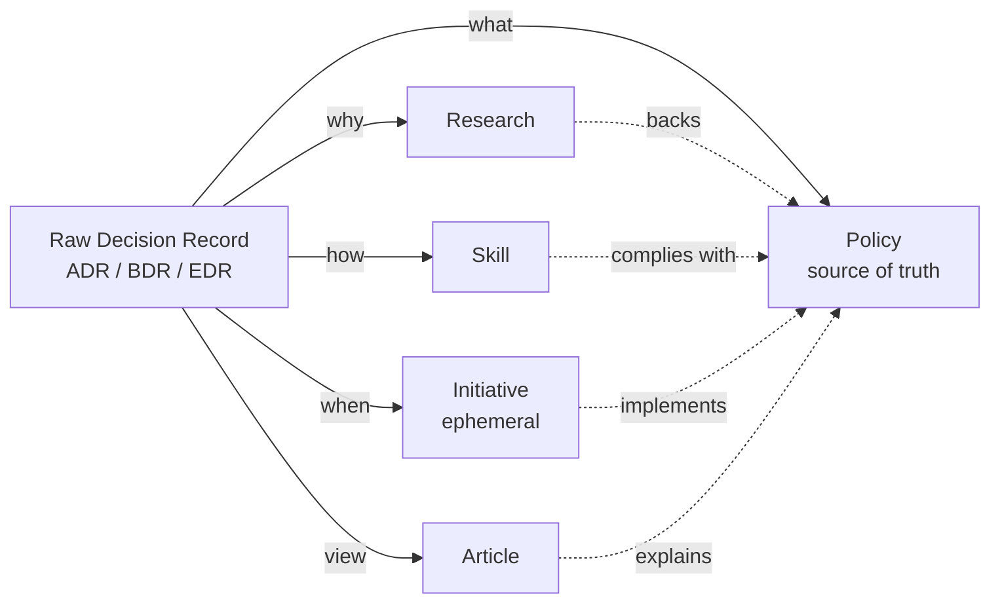
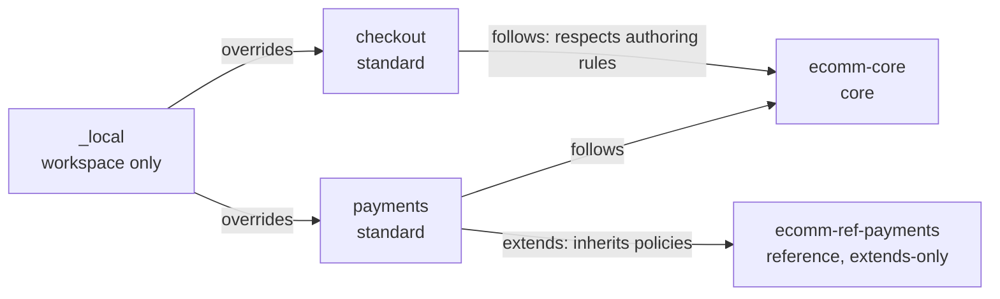
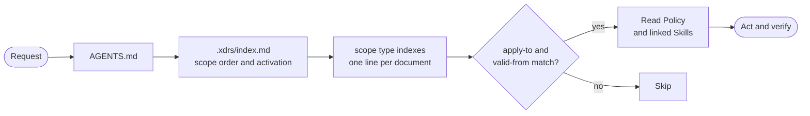
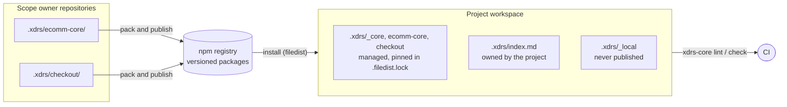
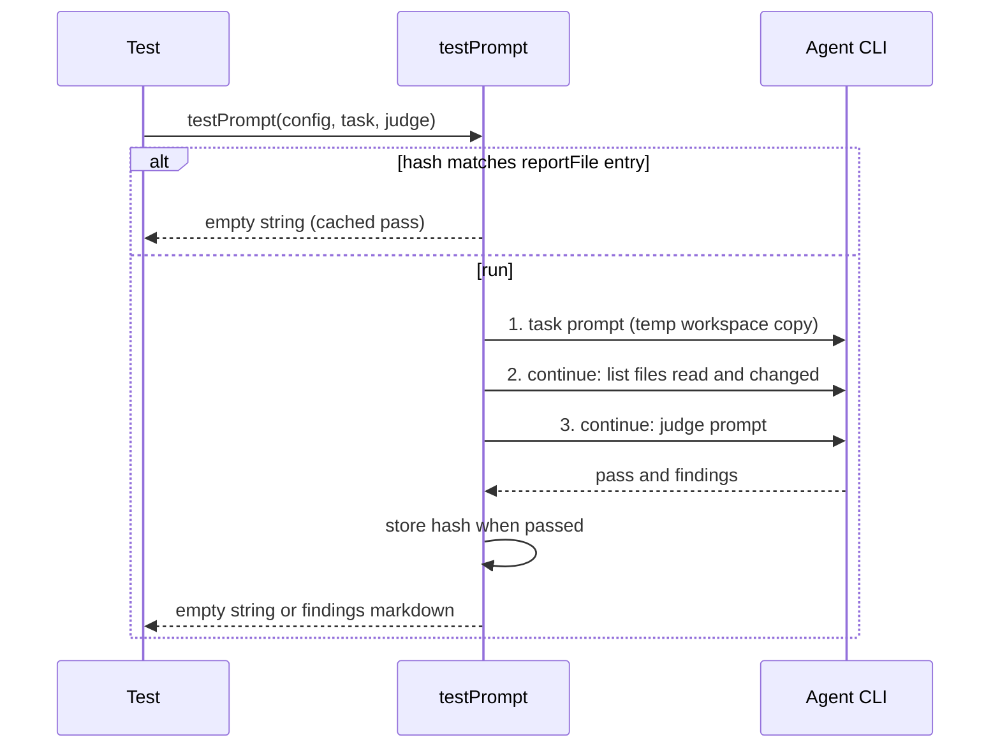

# xdrs-core

**XDRS — eXtensible Decision Record System**

XDRS is a framework to structure, compile and distribute Architectural (ADR), Business (BDR), and Engineering (EDR) decision records contents so that AI agents and humans can reliably find and use them with hierarchical scopes and controlled rollout in the format of distributable versioned packages. Decision Records are decomposed into Research (why), Policies (what), Skills (how), Initiative (when) and Articles (views) with a well structured index structure and the definition of hierarchical scopes.

After preparation those elements can be downloaded anywhere and used to compose xdrs corpus, which can be used as a context source for AI agents, web site publishing, RAG applications etc.

> **Note:** This repository contains a minimum set of standards and a very basic set of ADRs that describe the proposed structure. It is intended to be used as a foundation that other projects can reference, extend, or install as a dependency in order to bootstrap and create their own XDRS packages.

## Objective

Policies capture Architectural (ADR), Business (BDR), and Engineering (EDR) decisions. As organizations grow, hundreds of decisions accumulate across teams, levels, and domains. Without a consistent structure, AI agents cannot efficiently locate the right decisions for a given context, and humans cannot maintain or evolve them sustainably.

This project defines a standard for organizing XDRS that addresses this problem (see [Features](#features)).

## Overview



## XDRS elements

A traditional Decision Record normally combines several concerns in the same document:
- A **reason** (why the decision was made, options considered, evidence gathered)
- A **policy** (rules, core decision, what must be followed)
- An **initiative** (consequences, implementation approach, how to roll out the decision)
- A **how-to** (step-by-step procedure for executing under the decision)
- A **view** (overview of the topic connecting related decisions together)

The XDRS framework separates these concerns into different document types, each with a clear role:

- **Policies** — Documents that captures a policy, core decision, rule, guardrails or any other boundary, captured from a Architectural (ADR), Business (BDR), or Engineering (EDR) documents. They are the source of truth. This is the core document type in the framework.
- **Research** — Exploratory documents that capture the problem being investigated, constraints or requirements, findings, and option tradeoffs that back a decision during its lifecycle. One research document may inform multiple downstream decisions, but it is not a replacement for the Policy.
- **Skills** — Step-by-step procedural guides that can be followed by humans, AI agents, or both. Skills are task-based artifacts with a concrete outcome and should include enough detail to verify the task was completed correctly. A skill may start as a fully manual procedure and evolve toward partial or full AI automation over time.
- **Articles** — Synthetic explanatory texts that combine information from multiple Policies, Research documents, and Skills around a specific topic or audience. They never replace Policies as source of truth.
- **Initiatives** — Ephemeral execution documents that describe a problem, proposed solution, and the approach and activities needed to solve it. Initiatives have a clear start and end and must be deleted after full implementation. Lasting outputs are captured as Policies, Skills, Articles, or other artifacts.



The compilation process of a raw Decision Record is to distribute it into those different documents and create links between them. You can also use the framework standalone, generating these elements individually directly during the writing process without starting from a raw Decision Record.

## Getting started

1. Create a new project workspace

2. On the workspace root folder, run `npx xdrs-core`

   This installs:
     - `AGENTS.md` instructing agents to consult Policies before every request
     - `.xdrs/_core/` with the framework Policies, skills and articles
     - `.xdrs/index.md` root index, installed unmanaged so you own it and list your scopes there
     - `.agents/skills/review` and `.agents/skills/write-xdrs-doc` symlinks so agents discover the main skills

3. Run a prompt such as:

   > Create a policy about our decision on using Python for AI related projects. For high volume projects (expected >1000 t/s), an exception can be made on using Golang.

   > Compile ADR 043-python-package-manager into the XDRS structure

   > Review my changes against our Policies

4. Validate the result with `npx xdrs-core lint .`

### Bundled skills

| Skill | Purpose |
|---|---|
| `write-xdrs-doc` | Router: infers the document type from your request and delegates to the right skill below |
| `write-policy`, `write-skill`, `write-article`, `write-research`, `write-initiative` | Author each XDRS element type |
| `write-presentation` | Create Marp slide decks backing XDRS documents |
| `review` | Review code or documents against applicable Policies and report violations |
| `compile-scope` | Fetch and compile a `compiled`-type scope from external sources |

See [.xdrs/_core/adrs/index.md](.xdrs/_core/adrs/index.md) for the full list of `_core` Policies, skills and articles.

## Examples

- [examples/basic-usage](examples/basic-usage) shows the minimal consumer flow for installing the packaged `xdrs-core` tarball, extracting files, checking drift, and linting the resulting tree.
- [examples/mydevkit](examples/mydevkit) shows a reusable extension package that uses `.filedistrc` as its package config source, composes `xdrs-core`, and ships its own named scope.
- [examples/typed-scope](examples/typed-scope) shows `core`, `reference`, `platform` and `_local` scopes, a custom `business-area` scope type, and `follows`.
- [examples/load-test](examples/load-test) generates a large synthetic XDRS tree to exercise the linter at scale.
- For a fuller real-world package built on the same distribution model, see [flaviostutz/agentme](https://github.com/flaviostutz/agentme).


## Features

### Multi-scope support

Different teams at different organizational levels make decisions that apply to different audiences. XDRS are organized by scope (e.g. `_core`, `business-x`, `business-y-mobileapp`) so that each team owns its own decision space. Scopes can extend or override policies from broader scopes, with explicit precedence rules: scopes listed later in an index override those listed earlier.

### Scope types

Every scope declares a `scope-type` in its `index.md` frontmatter. The six built-in types are `core`, `reference`, `platform`, `compiled`, `standard`, and `_local`, each with different governance rules. Custom types (e.g. `business-area`) can be introduced by adding a `{type}-scope-type` policy to any `core`-type scope.

| Type | Purpose | Naming pattern | Root index order |
|---|---|---|---|
| `core` | Meta-governance: authoring standards, scope-type definitions, process guidance. No consumable policies. | `{name}-core` (e.g. `myorg-core`) | 1st |
| `reference` | Standards, regulations, or reference models to be adopted or adapted (e.g. PCI-DSS, ISO 27001, reference architectures). Not a live service. | `{domain}-ref-{name}` (e.g. `security-ref-baseline`) | 2nd |
| `platform` | Existing live services or infrastructure teams can consume directly (e.g. cloud platform, shared data service). | `{domain}-plat-{name}` (e.g. `cloud-plat-infra`) | 3rd |
| `compiled` | Policies compiled directly from external sources (web pages, git repos, local folders). All content must trace to source; no invented content. Combinable with other types. | Free-form (no naming requirement) | any, before `_local` |
| `standard` | Business areas, products, teams, or any general-purpose scope. Default type when nothing else fits. | Any valid scope name (e.g. `checkout`, `mobile-app`) | 4th |
| `_local` | Workspace-local overrides. Reserved exclusively for the `_local` scope. Never distributed. | `_local` (reserved) | last |

`_core` is the built-in `core` scope; teams can add their own (e.g. `myorg-core`) with organisation-level authoring standards.

**`compiled` scopes** hold policies compiled directly from external authoritative sources. All content must trace back to the source; no invented content is allowed. A `compiled` scope requires a local meta-policy with source URLs and compilation configuration, and uses the `compile-scope` skill to fetch, compile, and keep content up to date. The `compiled` type may be combined with another type (e.g. `scope-type: compiled, reference`) when the combined type's governance also applies.

```yaml
# .xdrs/owasp-top10/adrs/principles/001-core.md  (compilation meta-policy)
## Sources
- [web] owasp-top10-web: https://owasp.org/Top10/
- [git] owasp-top10-git: https://github.com/OWASP/Top10.git

## Selectors
Include A01–A10 risk entries only.

## Sync Settings
- Source re-sync period days: 30
```

By default, fetched and selected source content persists under `.assets/sources/[name]/` so later compilations can re-sync incrementally instead of always refetching; set `Source storage: temporary` in `## Sync Settings` to discard the bulk content after each run instead (only the per-source tracking file persists in that mode). Either way, `.assets/sources/` content is never authoritative on its own — only the compiled policies are.

### Scope relationships: `follows` and `extends`

The `follows` field in a scope's `index.md` links it to one or more `core` scopes whose standards it must respect (beyond `_core`). This models organisational hierarchies: a team scope can follow a business-area `core` scope, which in turn follows `_core`.

```yaml
# .xdrs/checkout/index.md
---
scope-type: standard
name: checkout
follows: ecomm-core        # must comply with ecomm-core authoring standards
description: Checkout team decisions
---
```

The `extends` field makes a scope inherit all **policy documents** (not skills, articles, research or initiatives) of other scopes, as if authored locally. Use it to adopt a `reference` scope and override only what differs. When scopes are related by `extends`, the chain decides conflicts instead of root index ordering. A scope cannot list the same scope in both `follows` and `extends`, cannot extend `_core`/`_local` or itself, and cannot form cycles.

```yaml
# .xdrs/payments/index.md
---
scope-type: standard
name: payments
extends: ecomm-ref-payments   # inherit its policies, override locally when needed
---
```

A scope can also hold its own authoring rules in a local meta-policy (`[type]/principles/NNN-core.md`) without creating a separate `-core` scope. See [_core-adr-policy-010](.xdrs/_core/adrs/principles/010-scope-governance.md) for the full precedence chain.



`_core` applies implicitly to every scope, so it is never listed in `follows` or `extends`.

The `checkout` scope in [examples/typed-scope](examples/typed-scope) uses a custom `business-area` type defined in `ecomm-core` and declares `follows: ecomm-core`.

### Scope activation

Every installed scope MUST be linked exactly once in `.xdrs/index.md`, and its non-meta policies apply globally by default. Consumers narrow that with an activation tag placed right after the link:

```markdown
Scopes tagged `disabled` MUST be ignored; `extends-only` scopes apply only via extends (see _core-adr-policy-022)

[View scope ecomm-ref-payments](ecomm-ref-payments/index.md) `extends-only`
[View scope legacy-standards](legacy-standards/index.md) `disabled`
```

- `extends-only`: the scope's policies apply only through scopes that list it in `extends:`.
- `disabled`: the scope is ignored; scopes that follow, extend or take their type from it become READ-ONLY.
- Scope authors declare `extends-only: true` in the scope `index.md` frontmatter when the scope is meant only to be extended; lint requires the root index tag to match.
- The root index belongs to the consumer: packages ship it unmanaged so tags survive reinstalls.

See [_core-adr-policy-022](.xdrs/_core/adrs/principles/022-scope-activation.md), [_core-adr-policy-010](.xdrs/_core/adrs/principles/010-scope-governance.md) and [_core-adr-policy-011](.xdrs/_core/adrs/principles/011-core-scope-type.md).

### Subject grouping

Within each scope and type, decisions are grouped by subject (e.g. `application`, `data`, `platform` for ADRs; `product`, `finance` for BDRs). This keeps related decisions together, improves human navigation, and allows AI agents to narrow their search to the relevant subject folder before reading individual records.

### Extensibility

Over time, decisions from various teams and domains accumulate in a shared workspace. The folder structure `.xdrs/[scope]/[type]/[subject]/` is designed to accommodate new scopes, types, and subjects without reorganizing existing content. A root index at `.xdrs/index.md` points to all canonical scope indexes, and each canonical index is updated incrementally as new XDRS scopes are added.

### Distributability

XDRS packages are versioned and distributed via the npm registry. This allows teams to adopt specific decision sets at a specific version, rather than accepting all decisions at once. It avoids "all or nothing" situations when linting or checking adherence to decisions in the context of tech debt management. Teams can pin, upgrade, or override only the scopes that are relevant to them.

### AI-agent friendliness

The folder layout, file naming, and document format are designed so that AI agents can efficiently work with hundreds of decisions:

- Each Policy is a small, focused Markdown file (target under 1300 words, hard limit 2600), covering a set of rules or statements.
- Policies that need external citation can expose individually numbered rules (e.g. `_core-adr-policy-010.28-extends-disjoint`), see [_core-adr-policy-008](.xdrs/_core/adrs/principles/008-policy-structured-standards.md).
- The canonical index per scope and type lists all XDRS elements with short descriptions, enabling agents to identify relevant records without reading every file.
- The root index at `.xdrs/index.md` provides a single entry point for discovery.
- Policy metadata gives agents a first-pass filter: check `valid-from` for the convergence date, then check `apply-to`, and finally the decision text itself to confirm the decision should be used in the current context. All documents present in the collection are considered active.
- Decisions cross-reference each other by Policy ID rather than duplicating content, keeping individual files concise.
- Subject folders reduce the search space when a query maps to a known domain.

How an agent finds the Policies that apply to a request:



### Multi-agent framework support

Policies and skills must be usable by any type of AI agent, not only coding agents (e.g. GitHub Copilot, Cursor, Cline). General-purpose agent frameworks such as LangGraph, CrewAI, AutoGen, and similar orchestration runtimes must be able to consume Policies without relying on IDE-specific tooling or conventions.

This is especially important for BDRs: because business rules govern decisions that span both technical and non-technical workflows, agents built with any framework must be able to discover, fetch, and apply BDRs programmatically using only standard file-system or HTTP access to Markdown files.

## Structure

```
.xdrs/
  index.md                          # root index pointing to all scope indexes
  [scope]/
    [type]/                         # adrs | bdrs | edrs
      index.md                      # canonical index for this scope+type
      [subject]/
        [number]-[short-title].md   # individual policy document
        .assets/                     # optional local resources for subject-level Policy files
        researches/                 # optional decision-backing research documents
          [number]-[short-title].md
          .assets/
        skills/                     # optional skill packages for humans and AI agents
          [skill-name]/
            SKILL.md
            .assets/
        articles/                   # optional synthetic views over Policies, Research, and Skills
          [number]-[short-title].md
          .assets/
        initiatives/                # optional ephemeral execution initiatives
          [number]-[short-title].md
          .assets/
```

Types:

- **ADR** - Architectural Decision Record: architectural and technical decisions
- **BDR** - Business Decision Record: business process and strategy decisions
- **EDR** - Engineering Decision Record: engineering workflow and tooling decisions

Each type has a fixed set of allowed subjects (e.g. `principles`, `application`, `data` for ADRs), see [_core-adr-policy-016](.xdrs/_core/adrs/principles/016-policy-subjects.md). Element types are described in [XDRS elements](#xdrs-elements).

See [.xdrs/index.md](.xdrs/index.md) for the full list of active policies.

For a deeper overview of XDRS — objective, structure, guidelines, extension, and usage — see the [XDRS Overview article](.xdrs/_core/adrs/principles/articles/001-xdrs-overview.md).
For packaging guidance on publishing your own reusable scope with Policies, Research documents, skills, and articles, see the [Create your own xdrs-core extension package article](.xdrs/_local/adrs/principles/articles/001-create-your-own-xdrs-extension-package.md), then compare [examples/basic-usage](examples/basic-usage) and [examples/mydevkit](examples/mydevkit).

## Flow: Decision -> Distribution -> Usage

Policies, Research documents, and skills follow a three-stage lifecycle that keeps decision-making decentralized while allowing controlled adoption across projects.

### Decision

Each scope manages its own set of XDRS artifacts independently. Scope owners discuss and evolve decisions through whatever process fits their team, such as RFCs, pull requests, or architecture review boards. Research documents, Policies, and skills are authored, reviewed, and merged within the scope's folder in the repository.

### Distribution

Once a set of decisions is ready to share, scope owners pack the relevant `.xdrs/[scope]/` folder into a versioned npm package using a tool such as [filedist](https://github.com/flaviostutz/filedist) and publish it to an npm registry, either public or a company-internal one. Versioning gives consumers explicit control over which revision of a scope's decisions they adopt, avoiding situations where a single breaking policy change is forced on all consumers at once.

The same applies to Research documents, skills, articles, and any sibling `.assets/` folders: because they live alongside Policies inside the scope folder, they are included in the same package and published together.

### Usage

A project that wants to follow a scope's decisions adds the corresponding npm package as a regular dependency. Using a tool such as [filedist](https://github.com/flaviostutz/filedist), the package contents are unpacked into the project's `.xdrs/` folder at install or update time. Updating the dependency version pulls in the latest Policies, Research documents, and skills for that scope, keeping the project aligned with the scope owners' current decisions.

Multiple scope packages can be combined in the same workspace by listing them as separate dependencies. Scope precedence (defined in `.xdrs/index.md`) determines which decisions take effect when scopes overlap.



## CLI

The published package exposes the `xdrs-core` CLI.

- `npx -y xdrs-core` (or `install`) installs or updates the managed XDRS files; `npx -y xdrs-core check` fails if managed files drifted from the package. Both are delegated to [filedist](https://github.com/flaviostutz/filedist) (run `--help` for all options).
- `npx -y xdrs-core lint [path]` validates the XDRS tree. Scopes listed in the workspace `.filedist.lock` are treated as external and skipped; use `--all` to include them.

The `lint` command reads `.xdrs/**` (or `[path]` directly when it contains an `index.md`) and reports errors citing the violated Policy rule. It checks:

- **Structure**: allowed scope, type and subject folders; canonical indexes present and linking every document; root index linking every scope exactly once with valid activation tags
- **Numbering**: unique numbers per element type, subject-based numbering ranges ([_core-adr-policy-017](.xdrs/_core/adrs/principles/017-policy-numbering-ranges.md))
- **Document format**: Policy metadata (`valid-from`, `apply-to`), structured rule syntax, initiative `Expected end date`, skill `README.md`, word limits per element type
- **Scope governance**: scope-type definitions and naming conventions, `follows`/`extends` targets, cycles and conflicts, local meta-policies, `compiled` scope meta-policy
- **Links**: local markdown links and `.assets/` references resolve (fenced code blocks are ignored)

Examples:

```bash
npx -y xdrs-core lint .
npx -y xdrs-core lint ./some-project
pnpm exec xdrs-core lint .
```

## Library Testing

The package also exposes a reusable behavior-test library for Jest or any other JavaScript test runner.

Main exports:

- `async testPrompt(config, inputPrompt, judgePrompt, id?, verbose?)` runs the task prompt, evaluates the result with a judge prompt, and resolves to an empty string on success or a markdown bullet list of findings on failure. Passing results are cached (see below).
- `async runPromptTest(config, inputPrompt, judgePrompt, verbose?)` resolves to the structured result (`passed`, `findings`, `taskOutput`, `agentReportedChanges`, `contextFiles`, `workspace`), without caching.
- `copilotCmd(workspaceRoot?)` returns a partial config for the Copilot CLI in headless mode (`promptCmd`, `promptCmdContinueFlag`, `workspaceFilter`, `workspaceExclude`). Spread it into your config. `workspaceRoot` defaults to the current git repository root.

Main `config` fields:

| Field | Description |
|---|---|
| `promptCmd` | Command as string array or JSON array string; must include a `{PROMPT}` placeholder |
| `promptCmdContinueFlag` | Flag inserted before the prompt to continue the previous session (e.g. `--continue`) |
| `workspaceRoot` | Workspace under test (default: current git repository root) |
| `workspaceMode` | `copy` (default, runs in a temp copy honoring `.gitignore`, without git metadata) or `in-place` |
| `workspaceFilter` / `workspaceExclude` | Globs selecting which files are copied |
| `taskTimeoutMs` / `judgeTimeoutMs` | Timeouts per phase |
| `env` | Extra environment variables for the command |
| `reportFile` | Cache file of passing tests (default: `<test-file>.report` next to the calling test); `null` disables caching |
| `checkOnly` | Do not run prompts; fail unless a matching passing entry exists in `reportFile` (useful in CI) |
| `model` | Model name, included in the cache hash |

Execution model:

1. **Task**: runs the task prompt and captures the final output
2. **Files**: continues the same session to collect the files the agent read and changed
3. **Judge**: continues the same session and evaluates the task output, changed files and workspace state against the judge prompt

A passing result is stored in `reportFile` with a hash of the model, prompts and the files the agent read. Later runs are skipped while that hash is unchanged, so tests re-run only when relevant context changes.



Example with Jest:

```js
const { copilotCmd, testPrompt } = require('xdrs-core');

test('creates hello.md', async () => {
  const err = await testPrompt(
    {
      ...copilotCmd(process.cwd()),
      workspaceRoot: process.cwd(),
      workspaceMode: 'copy'
    },
    "Create a nice markdown file at hello.md saying 'hello!'",
    'The resulting file should be created at hello.md and have hello as part of its contents, without too much extra info (should be <100 chars)'
  );

  expect(err).toBe('');
});
```

